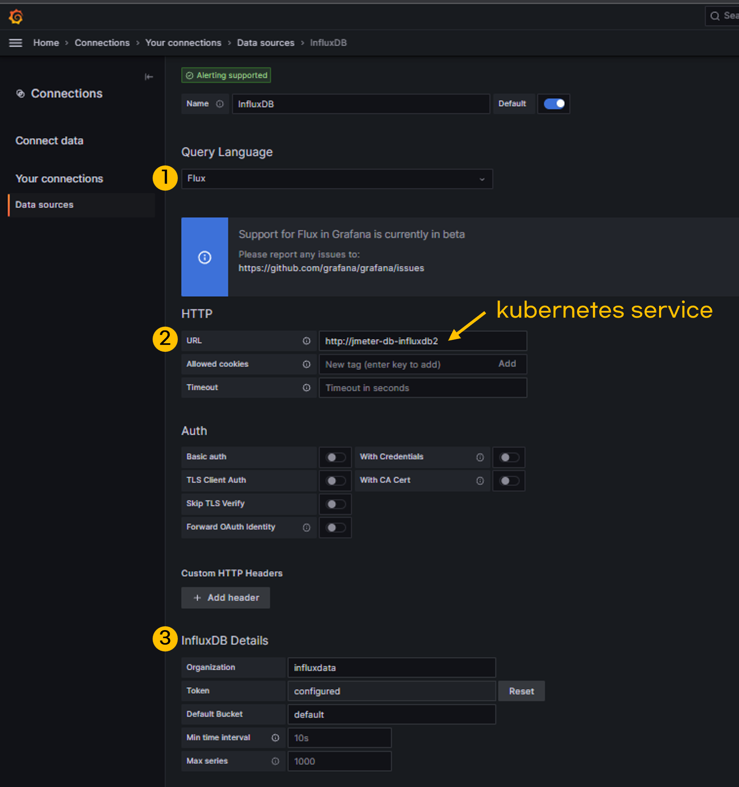
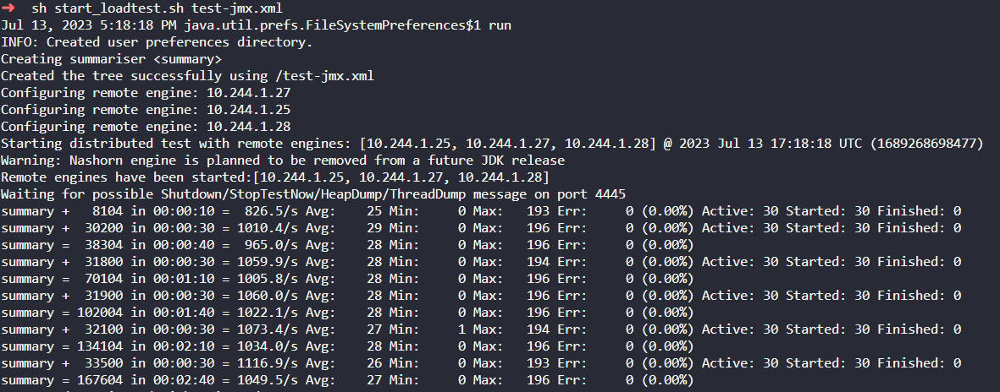
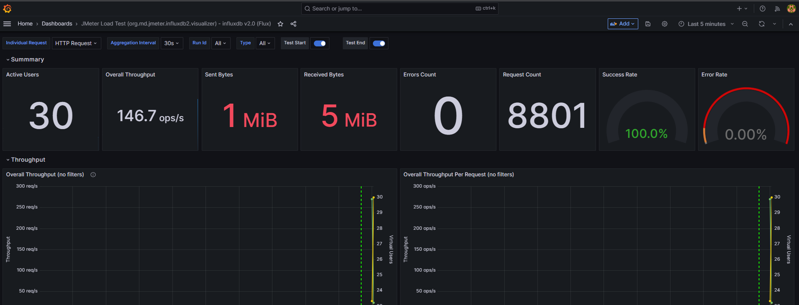

- [개요](#--)
- [전제조건](#----)
- [테스트 환경](#------)
- [테스트용 쿠버네티스 설치](#-------------)
- [부하 테스트 시스템 구축](#-------------)
  * [설치](#--)
- [그라파나 설정](#-------)
  * [그라파나와 influxdb 연결](#------influxdb---)
  * [그라파나 대시보드 추가](#------------)
- [부하 테스트 메뉴얼](#----------)
  * [jmeter target pod 배포](#jmeter-target-pod---)
  * [jmeter controller, worker pod 배포](#jmeter-controller--worker-pod---)
  * [부하테스트 스크립트 실행](#-------------)
  * [부하테스트 중지](#--------)
  * [부하테스트 재실행](#---------)
- [삭제](#--)
- [(부록) 로컬PC 테스트](#-------pc----)
  * [jmter-influxdb2 listener 플러그인 설치](#jmter-influxdb2-listener--------)
- [참고자료](#----)

# 개요
* 쿠버네티스에서 jmeter cluster를 구축하고 부하 테스트

# 전제조건
* jmeter 아키텍처를 알고 있어야 함
* jmeter 설정파일(jmx)을 생성할 수 있어야 함
  * 데모 jmeter 설정파일이 scripts/test-jmx.xml에 있음

# 테스트 환경
* JDK: 11(influxdb2 플러그인 요구사항)
* 쿠버네티스: 1.20
* jmter: 5.5(influxdb2 플러그인 요구사항)

# 테스트용 쿠버네티스 설치
> 쿠버네티스가 있다면 skip

* 쿠버네티스 버전 1.20 사용
* kind cluster 사용(docker 필요)
```bash
# 생성
cd kind-cluster
kind create cluster --config cluster.yaml

# 삭제
cd kind-cluster
kind delete cluster --name  jmeter-test
```

# 부하 테스트 시스템 구축
* influxDBv2와 grafana를 설치
* helm3 사용

## 설치
* makefile를 사용하여 helm install을 자동화
* grafana와 influxdb는 persistence를 비활성화(운영환경에서는 persistence volume사용해야 함)
* grafana와 influxdb nodeport를 사용
```bash
# helm install influxDB2, grafana
make install
```

# 그라파나 설정
## 그라파나와 influxdb 연결


## 그라파나 대시보드 추가
* influxdb2: https://grafana.com/grafana/dashboards/13644-jmeter-load-test-org-md-jmeter-influxdb2-visualizer-influxdb-v2-0-flux/

# 부하 테스트 메뉴얼
> grafana, influxdb가 설치되어 있고 grafana설정이 되어 있다는 전제로 테스트 진행

## jmeter target pod 배포
* echoserver 사용
```bash
kubectl apply -n default -f ./echo-server.yaml
```

## jmeter controller, worker pod 배포
```bash
kubectl -n default apply -f jmeter-k8s-manifests/
kubectl -n default get po
```

## 부하테스트 스크립트 실행
* 스크립트를 실행하는 순간 pod 쉘이 forground로 실행됨
```bash
cd scripts
sh start_loadtest.sh test-jmx.xml
```





## 부하테스트 중지
```bash
1. ctrl + C로 controller pod forground 중지
2. kubectl delete -f jmeter-k8s-manifests/
```

## 부하테스트 재실행
```bash
1. 기존 부하테스트 중지 (kubectl delete -f jmeter-k8s-manifests/)
2. jmeter controller, worker pod가 없어졌는지 확인
3. 다시 부하테스트 스크립트 실행
```

# 삭제
* jmeter manifest 삭제
```bash
kubectl delete -f jmeter-k8s-manifests/
```

* grafana, influxdb 삭제
```bash
# helm uninstall
make clean -k
```

# (부록) 로컬PC 테스트
## jmter-influxdb2 listener 플러그인 설치
* 플러그인 다운로드 링크: https://github.com/mderevyankoaqa/jmeter-influxdb2-listener-plugin/releases
* 플러그인 이동: jmeter/lib/ext 경로로 플러그인 이동

# 참고자료
* jmeter influxdb2 backend listener: https://github.com/mderevyankoaqa/jmeter-influxdb2-listener-plugin
* jmeter dockerfile: https://github.com/Kartik-1611/Jmeter_on_GKE/tree/master/Dockerfiles/jmeter-base
* jmeter 구조: https://doqtqu.tistory.com/274
* 과거의 내가 만든 jmeter cluster: https://github.com/choisungwook/portfolio/tree/master/kubernetes/helm/jmeter